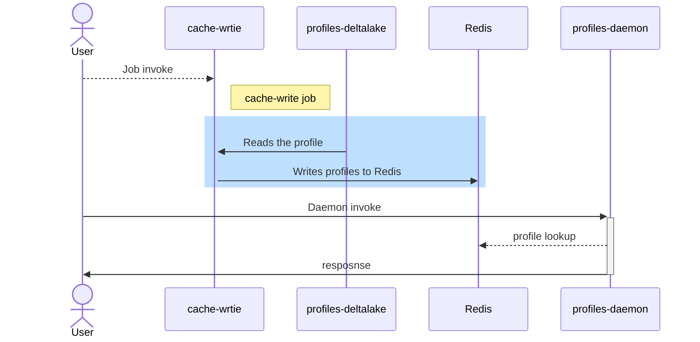

# Writing Profiles to cache(Redis)

This example is a CLI application that writes profile data from a Delta table to Redis, for real time profile fetch.
This builds off of the [Local Clients](../local-clients/README.md) example for its initial setup.

(See [RedisWrite.java](./src/main/java/com/c12e/cortex/examples/cache/CacheWrite.java) for the source code.)



## Prerequisites

* The Redis Spark connector is required to run this example (`com.redislabs:spark-redis_2.12:3.1.0`). 
  Download the [Redis Spark Connector](https://repo1.maven.org/maven2/com/redislabs/spark-redis_2.12/3.1.0/spark-redis_2.12-3.1.0-jar-with-dependencies.jar) and 
  save the files in [../main-ap/src/main/resources/lib/](../main-app/src/main/resources/lib/).
* A separate Redis infrastructure is suggested to be used, separate from the internal/external Cortex Redis cluster, used by other services.
* Redis configurations supported
  * No (out of the box)sentinel support, the standalone node to which this is connected, if restarts, the job goes down, There is a PR out for the support (https://github.com/RedisLabs/spark-redis/pull/245) [Not OK]
  * Cluster support, Tested with GCP memoryStore [OK]
  * Standalone support, single node [OK]
  * Enterprise Redis [Not Tested]
* <b>Redis cluster sizing is highly dependent on the Data size</b> 
  * Here is a Data size vs Redis Memory table for reference
  
    | Data size                           | Redis Memory |
    |-------------------------------------|--------------|
    | 1M records X 150 columns            | 3.41Gb       |
    | 2340223(2.3M) records X 150 columns | 8Gb          |
    | 2764171(2.7M) records X 150 columns | 9.42Gb       |
    | 8.37M records X 150 columns         | 32 Gb        |


## Run Locally

To run this example locally with local Cortex clients (from the parent directory):
1. Start up a Redis instance locally, in a docker container.
   ```
   make start-redis
   ```
2. Build the application.
    ```
    make build
    ```
3. Run the `build-profiles` example to build the Profiles, since here we write the Profiles' data to Redis.
   ```
   ./gradlew main-app:run --args="build-profile --project local --profile-schema member-profile"
   ```
4. Run the `cache-profile` application to load the Profiles built in the previous step.
    ```
    ./gradlew main-app:run --args="cache-profile -p local -ps member-profile"
    ```

The end of the log output should be similar to:
```
18:03:20.053 [main] INFO  org.apache.spark.ui.SparkUI - Bound SparkUI to 0.0.0.0, and started at http://192.168.0.102:4040
18:03:20.614 [main] INFO  o.s.j.server.handler.ContextHandler - Started o.s.j.s.ServletContextHandler@77d4ac52{/metrics/json,null,AVAILABLE,@Spark}
18:03:21.348 [main] INFO  o.s.j.server.handler.ContextHandler - Started o.s.j.s.ServletContextHandler@7f3c0399{/SQL,null,AVAILABLE,@Spark}
18:03:21.349 [main] INFO  o.s.j.server.handler.ContextHandler - Started o.s.j.s.ServletContextHandler@3a11c0eb{/SQL/json,null,AVAILABLE,@Spark}
18:03:21.349 [main] INFO  o.s.j.server.handler.ContextHandler - Started o.s.j.s.ServletContextHandler@53dd42d6{/SQL/execution,null,AVAILABLE,@Spark}
18:03:21.351 [main] INFO  o.s.j.server.handler.ContextHandler - Started o.s.j.s.ServletContextHandler@447fa959{/SQL/execution/json,null,AVAILABLE,@Spark}
18:03:21.379 [main] INFO  o.s.j.server.handler.ContextHandler - Started o.s.j.s.ServletContextHandler@7d66e544{/static/sql,null,AVAILABLE,@Spark}
18:03:24.313 [main] DEBUG c.c.c.p.m.c.DefaultCortexConnectionReader - Removed hadoop filesystem - format_type: delta, uri: ./build/test-data//cortex-profiles/profiles/local/member-profile-delta, extra 
18:03:38.060 [main] WARN  o.a.spark.sql.catalyst.util.package - Truncated the string representation of a plan since it was too large. This behavior can be adjusted by setting 'spark.sql.debug.maxToStringFields'.
18:03:42.672 [shutdown-hook-0] INFO  o.s.jetty.server.AbstractConnector - Stopped Spark@1352434e{HTTP/1.1, (http/1.1)}{0.0.0.0:4040}
18:03:42.675 [shutdown-hook-0] INFO  org.apache.spark.ui.SparkUI - Stopped Spark web UI at http://192.168.0.102:4040

Deprecated Gradle features were used in this build, making it incompatible with Gradle 8.0.

You can use '--warning-mode all' to show the individual deprecation warnings and determine if they come from your own scripts or plugins.

See https://docs.gradle.org/7.4/userguide/command_line_interface.html#sec:command_line_warnings

BUILD SUCCESSFUL in 36s
43 actionable tasks: 1 executed, 42 up-to-date
```

The Redis connection details have been defined in the [SessionExample.java](../local-clients/src/main/java/com/c12e/cortex/examples/local/SessionExample.java) file
for local connections and can be passed via [spark-conf.json](../cache-profile/src/main/resources/conf/spark-conf.json)`./main-app/build/tmp/test-data/sink-ds` for jobs that need to be run in cluster.
More configurations can be found [here](https://github.com/RedisLabs/spark-redis/blob/master/doc/configuration.md)


## Run Locally in a Docker Container With Spark-submit

To run this example in a Docker container with local Cortex clients (from the parent directory):
1. Build the application.
    ```
    make build
    ```
2. Crate the Skill Docker image.
    ```
    make create-app-image
    ```
3. Export a Cortex Token.
    ```
    export CORTEX_TOKEN=<token>
    ```
4. Run the `build-profiles` example to build the profile, since here we write the profiles data to redis
   ```
   docker run -p 4040:4040 --entrypoint="python" \
      -e CORTEX_TOKEN="${CORTEX_TOKEN}" \
      -v $(pwd)/build-profiles/src/main/resources/conf:/app/conf \
      -v $(pwd)/main-app/src:/opt/spark/work-dir/src \
      -v $(pwd)/main-app/build:/opt/spark/work-dir/build \
    profiles-example submit_job.py "{ \"payload\" : { \"config\" : \"/app/conf/spark-conf.json\" } }"
   ```
5. Run the application with Docker.
    ```
    docker run -p 4040:4040 \
      --entrypoint="python" \
      -e CORTEX_TOKEN="${CORTEX_TOKEN}" \
      -v $(pwd)/cache-profile/src/main/resources/conf:/app/conf \
      -v $(pwd)/main-app/src:/opt/spark/work-dir/src \
      -v $(pwd)/main-app/build:/opt/spark/work-dir/build \
      profiles-example submit_job.py "{\"payload\" : {\"config\": \"/app/conf/spark-conf.json\"}}"
    ```
   NOTES:
    * Port 4040 is forwarded from the container to expose the Spark UI (for debugging).
    * The first volume mount is sharing the [Spark-submit config file](./src/main/resources/conf/spark-conf.json).
    * The second volume mount shares the LocalCatalog contents and other local application resources.
    * The third volume mount is the output location of the joined connection.
    * Make sure the spark-conf point to `"spark.redis.host": "host.docker.internal",` for the container to be able to access redis.

The end of the logs should be similar to:
```
13:59:36.030 [main] INFO  o.s.j.server.handler.ContextHandler - Started o.s.j.s.ServletContextHandler@46c269e0{/executors/threadDump/json,null,AVAILABLE,@Spark}
13:59:36.046 [main] INFO  o.s.j.server.handler.ContextHandler - Started o.s.j.s.ServletContextHandler@6069dd38{/static,null,AVAILABLE,@Spark}
13:59:36.048 [main] INFO  o.s.j.server.handler.ContextHandler - Started o.s.j.s.ServletContextHandler@6981f8f3{/,null,AVAILABLE,@Spark}
13:59:36.050 [main] INFO  o.s.j.server.handler.ContextHandler - Started o.s.j.s.ServletContextHandler@2eae4349{/api,null,AVAILABLE,@Spark}
13:59:36.052 [main] INFO  o.s.j.server.handler.ContextHandler - Started o.s.j.s.ServletContextHandler@117525fe{/metrics,null,AVAILABLE,@Spark}
13:59:36.053 [main] INFO  o.s.j.server.handler.ContextHandler - Started o.s.j.s.ServletContextHandler@46963479{/jobs/job/kill,null,AVAILABLE,@Spark}
13:59:36.055 [main] INFO  o.s.j.server.handler.ContextHandler - Started o.s.j.s.ServletContextHandler@6dd1c3ed{/stages/stage/kill,null,AVAILABLE,@Spark}
13:59:36.061 [main] INFO  org.apache.spark.ui.SparkUI - Bound SparkUI to 0.0.0.0, and started at http://df81c31332e3:4040
13:59:36.926 [main] INFO  o.s.j.server.handler.ContextHandler - Started o.s.j.s.ServletContextHandler@1163a27{/metrics/json,null,AVAILABLE,@Spark}
13:59:36.927 [main] INFO  o.s.j.server.handler.ContextHandler - Started o.s.j.s.ServletContextHandler@502a4156{/metrics/prometheus,null,AVAILABLE,@Spark}
13:59:37.691 [main] INFO  o.s.j.server.handler.ContextHandler - Started o.s.j.s.ServletContextHandler@2ee39e73{/SQL,null,AVAILABLE,@Spark}
13:59:37.692 [main] INFO  o.s.j.server.handler.ContextHandler - Started o.s.j.s.ServletContextHandler@71a4f441{/SQL/json,null,AVAILABLE,@Spark}
13:59:37.693 [main] INFO  o.s.j.server.handler.ContextHandler - Started o.s.j.s.ServletContextHandler@13866329{/SQL/execution,null,AVAILABLE,@Spark}
13:59:37.695 [main] INFO  o.s.j.server.handler.ContextHandler - Started o.s.j.s.ServletContextHandler@1a9ec80e{/SQL/execution/json,null,AVAILABLE,@Spark}
13:59:37.712 [main] INFO  o.s.j.server.handler.ContextHandler - Started o.s.j.s.ServletContextHandler@5c48b72c{/static/sql,null,AVAILABLE,@Spark}
13:59:44.042 [main] DEBUG c.c.c.p.m.c.DefaultCortexConnectionReader - Removed hadoop filesystem - format_type: delta, uri: src/main/resources/data/cortex-profiles/profiles/local/member-profile-delta, extra
14:00:00.822 [main] WARN  o.a.spark.sql.catalyst.util.package - Truncated the string representation of a plan since it was too large. This behavior can be adjusted by setting 'spark.sql.debug.maxToStringFields'.
14:00:03.872 [shutdown-hook-0] INFO  o.s.jetty.server.AbstractConnector - Stopped Spark@2def7a7a{HTTP/1.1, (http/1.1)}{0.0.0.0:4040}
14:00:03.876 [shutdown-hook-0] INFO  org.apache.spark.ui.SparkUI - Stopped Spark web UI at http://df81c31332e3:4040
Pod Name: 
Container State: 
Termination Reason: 
Exit Code: 0
```

The redis connection details have been defined in the [SessionExample.java](../local-clients/src/main/java/com/c12e/cortex/examples/local/SessionExample.java) file
for local connections and can be passed via [spark-conf.json](../cache-profile/src/main/resources/conf/spark-conf.json)`./main-app/build/tmp/test-data/sink-ds` for jobs that need to be run in cluster.
More configurations can be found [here](https://github.com/RedisLabs/spark-redis/blob/master/doc/configuration.md).

### Run as a Skill

### Prerequisites
* Ensure that the Cortex resources exist, specifically the Cortex Project and Profiles (built). **The underlying Data Source of the Profile does not need to exist.**
* Generate a `CORTEX_TOKEN`.
* Update/Add the [spark-conf.json](./src/main/resources/conf/spark-conf.json) file to:
    - Use the [Remote Catalog](../docs/catalog.md#remote-catalog) implementation by setting the Cortex URL (`spark.cortex.client.phoenix.url`) to the in-cluster GraphQL API endpoint (`"http://cortex-api.cortex.svc.cluster.local:8080"`) and removing the Local Catalog implementation (`spark.cortex.catalog.impl`).
    - Use the [remote storage client](../docs/backendstorage.md#remote-storage-client) implementation by setting the Cortex URL (`spark.cortex.client.phoenix.url`) to the GraphQL API endpoint, and remove the local storage client implementation (`spark.cortex.client.storage.impl`).
    - Remove the local Secret client implementation (`spark.cortex.client.secrets.impl`).
    - Update the `app_command` arguments to match your Cortex Project and Profile Schema (`--project`, `--profile`).
    - Update the `spark.redis.*` [configurations](https://github.com/RedisLabs/spark-redis/blob/master/doc/configuration.md) in the spark-conf.
    
To Build and run the skill:
1. Run the following make commands:
```
make build create-app-image deploy-skill invoke
```

### Example

```json
{
  "pyspark": {
    "pyspark_bin": "bin/spark-submit",
    "app_command": [
      "cache-profile",
      "--project",
      "loadtest",
      "--profile",
      "profile1"
    ],
    "app_location": "local:///app/libs/app.jar",
    "options": {
      "--master": "k8s://https://kubernetes.default.svc:443",
      "--deploy-mode": "cluster",
      "--name": "profile-examples",
      "--class": "com.c12e.cortex.examples.Application",
      "--conf": {
        "spark.app.name": "CortexProfilesExamples",
        "spark.ui.enabled": "true",
        "spark.ui.prometheus.enabled": "true",
        "spark.sql.streaming.metricsEnabled": "true",
        "spark.cortex.catalog.impl": "com.c12e.cortex.profiles.catalog.CortexRemoteCatalog",
        "spark.cortex.client.phoenix.url": "http://cortex-api.cortex.svc.cluster.local:8080",
        "spark.cortex.storage.bucket.profiles": "profiles-perf-profiles",
        "spark.executor.instances": "6",
        "spark.kubernetes.executor.limit.cores": "3",
        "spark.kubernetes.executor.request.cores": "1",
        "spark.kubernetes.driver.request.cores": "1",
        "spark.kubernetes.driver.limit.cores": "2",
        "spark.driver.memory": "6g",
        "spark.executor.memory": "6g",
        "spark.executor.memoryOverhead": "2G",
        "spark.task.cpus": "1",
        "spark.executor.cores": "3",
        "spark.sql.debug.maxToStringFields": "1024",

        "spark.redis.host": "cortex-redis-node-0.cortex-redis-headless.cortex.svc.cluster.local",
        "spark.redis.port": "6379",
        "spark.redis.timeout": "20000000",
        "spark.redis.user": "default",
        "spark.redis.auth": "something",

        "spark.cortex.client.secrets.url": "http://cortex-accounts.cortex.svc.cluster.local:5000",
        "spark.cortex.client.url": "https://api.test.cvstest.gke.insights.ai",
        "spark.cortex.storage.storageType": "gcs",
        "spark.cortex.storage.gcs.authType": "COMPUTE_ENGINE",
        "spark.kubernetes.namespace": "cortex-compute",
        "spark.kubernetes.driver.master": "https://kubernetes.default.svc",
        "spark.kubernetes.driver.container.image": "private-registry.test.cvstest.gke.insights.ai/profiles-example:latestfs2",
        "spark.kubernetes.executor.container.image": "private-registry.test.cvstest.gke.insights.ai/profiles-example:latestfs2",
        "spark.kubernetes.driver.podTemplateContainerName": "fabric-action",
        "spark.kubernetes.executor.annotation.traffic.sidecar.istio.io/excludeOutboundPorts": "7078,7079",
        "spark.kubernetes.driver.annotation.traffic.sidecar.istio.io/excludeInboundPorts": "7078,7079",
        "spark.kubernetes.container.image.pullPolicy": "Always",
        "spark.executor.processTreeMetrics.enabled": "false",
        "spark.metrics.conf.*.sink.prometheusServlet.class": "org.apache.spark.metrics.sink.PrometheusServlet",
        "spark.metrics.conf.*.sink.prometheusServlet.path": "/metrics/prometheus",
        "spark.metrics.conf.master.sink.prometheusServlet.path": "/metrics/master/prometheus",
        "spark.metrics.conf.applications.sink.prometheusServlet.path": "/metrics/applications/prometheus",
        "spark.sql.extensions": "io.delta.sql.DeltaSparkSessionExtension",
        "spark.sql.catalog.spark_catalog": "org.apache.spark.sql.delta.catalog.DeltaCatalog",
        "spark.databricks.delta.schema.autoMerge.enabled": "true",
        "spark.databricks.delta.merge.repartitionBeforeWrite.enabled": "true",
        "spark.kubernetes.executor.volumes.persistentVolumeClaim.spark-local-dir-1.options.claimName": "OnDemand",
        "spark.kubernetes.executor.volumes.persistentVolumeClaim.spark-local-dir-1.options.storageClass": "standard-rwo",
        "spark.kubernetes.executor.volumes.persistentVolumeClaim.spark-local-dir-1.options.sizeLimit": "50Gi",
        "spark.kubernetes.executor.volumes.persistentVolumeClaim.spark-local-dir-1.mount.path": "/data",
        "spark.kubernetes.executor.volumes.persistentVolumeClaim.spark-local-dir-1.readOnly": "false"
      }
    }
  }
}
```

Notes on the above example:
* The `--master` and `--deploy-mode` have been set to run the Spark job in the Cortex (Kubernetes) Cluster.
* The Cortex API Client URL and Secret Client URL are referring to services in Kubernetes Cluster.
* The Spark Driver and Spark Executors (`"spark.executor.instances"`) have a 2g and 4g of memory respectively. **Adjust the amount of resources used for your cluster/data.**
* The Cortex [Backend Storage configuration](../docs/config.md#cortex-backend-storage) is configured by the default remote  storage client implementation.
* - Update the `spark.redis.*` [configurations](https://github.com/RedisLabs/spark-redis/blob/master/doc/configuration.md) in the spark-conf.
