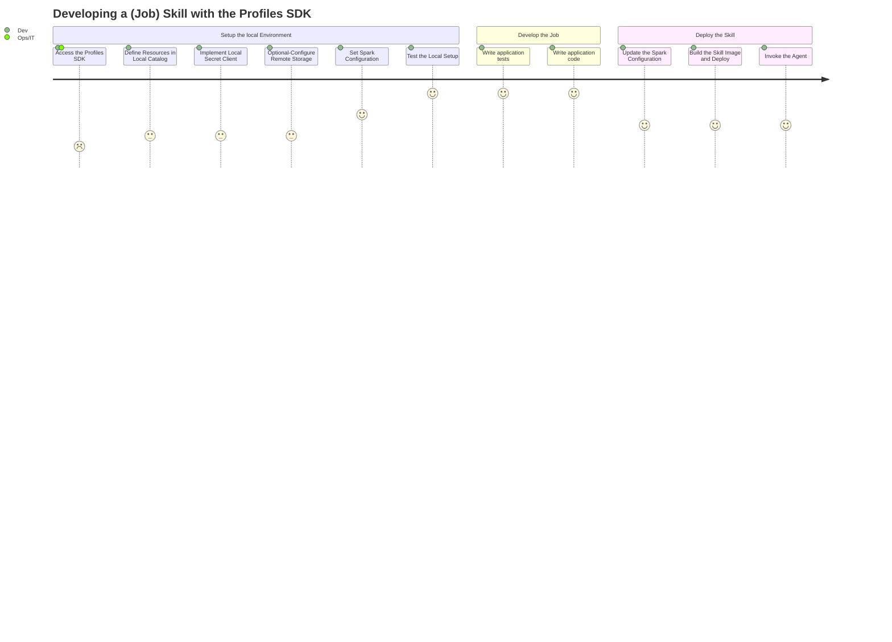
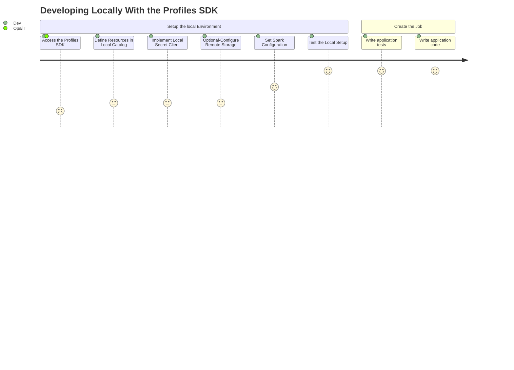

User Journey (local development)

```mermaid
journey
  title Developing a (Job) Skill with the Profiles SDK
  section Setup the local Environment
    %% Not publicly available, requires special (internal) access
    Access the Profiles SDK: 2: Dev, Ops/IT

    %% I have to re-define my Connections, DataSources, and Profile Schemas? (Shocked Pikachu)
    %% Yes, but 1) this can let you use a local (smaller) copy of the datasets before working with
    %% the Connections in the Console and 2) the representation is not too dis-similar than the object (JSON/YAML)
    %% used by Console/CLI.
    Define Resources in Local Catalog: 3: Dev

    %% I have to re-define any secrets for my Connections? (only if you're data is remote!)
    Implement Local Secret Client: 3: Dev

    %% You can't write to Cortex Remote Storage when working locally (unless you know the Cluster config - but most dont)
    Optional-Configure Remote Storage: 3: Dev

    %% Set the configuration properties to use the local clients, then create a CortexSession
    Set Spark Configuration: 5: Dev

    %% Test the job can access the local Cortex Resources
    Test the Local Setup: 7: Dev

  section Develop the Job
    %% Kept these abstract, but this is whatever the Job needs to do with the
    %% Cortex data. (Everybody loves writing tests!)
    Write application tests: 7: Dev
    Write application code: 7: Dev

  section Deploy the Skill
    %% This requires some trial/error with the configuration and invoking the Agent
    Update the Spark Configuration: 4: Dev
    Build the Skill Image and Deploy: 4: Dev
    Invoke the Agent: 4: Dev
```

```mermaid
journey
  title Developing Locally With the Profiles SDK
  section Setup the local Environment
    %% Not publicly available, requires special (internal) access
    Access the Profiles SDK: 2: Dev, Ops/IT

    %% I have to re-define my Connections, DataSources, and Profile Schemas? (Shocked Pikachu)
    %% Yes, but 1) this can let you use a local (smaller) copy of the datasets before working with
    %% the Connections in the Console and 2) the representation is not too dis-similar than the object (JSON/YAML)
    %% used by Console/CLI.
    Define Resources in Local Catalog: 3: Dev

    %% I have to re-define any secrets for my Connections? (only if you're data is remote!)
    Implement Local Secret Client: 3: Dev

    %% You can't write to Cortex Remote Storage when working locally (unless you know the Cluster config - but most dont)
    Optional-Configure Remote Storage: 3: Dev

    %% Set the configuration properties to use the local clients, then create a CortexSession
    Set Spark Configuration: 5: Dev

    %% Test the job can access the local Cortex Resources
    Test the Local Setup: 7: Dev
  section Create the Job
    %% Kept these abstract, but this is whatever the Job needs to do with the data. (Everybody loves writing tests!)
    Write application tests: 7: Dev
    Write application code: 7: Dev
```
