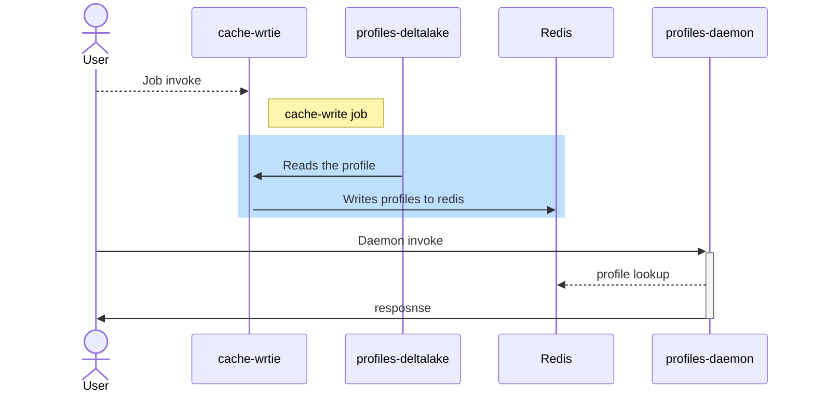

# Daemon for Realtime profile access

This example is a Spring API server application that exposes some APIs for realtime Profile fetch. 
This works in conjunction with [Cache Profile](../cache-profile/README.md) example for its initial setup.

(See [ProfileApplication.java](./src/main/java/com/c12e/cortex/examples/profilesDaemon/ProfilesApplication.java) for the source code.)



## Prerequisites

* Run the [Cache Profile](../cache-profile/README.md) example for the Daemon to be able to retrieve profile data from redis.

## Run Locally

To run this Daemon locally with local Redis Setup:
1. Start up a redis instance locally
2. Setup redis env vars using
    ```
    export REDIS_HOST=localhost
    export REDIS_PORT=6379
    export REDIS_USER=default
    export REDIS_PASSWORD=XXXX
    ``` 
3. Build the application.
    ```
    make build-daemon
    ```
4. Start the Daemon the locally
   ```
   make start-daemon
   ```

The end of the log output should be similar to:
```
> Task :profiles-daemon:bootRun

  .   ____          _            __ _ _
 /\\ / ___'_ __ _ _(_)_ __  __ _ \ \ \ \
( ( )\___ | '_ | '_| | '_ \/ _` | \ \ \ \
 \\/  ___)| |_)| | | | | || (_| |  ) ) ) )
  '  |____| .__|_| |_|_| |_\__, | / / / /
 =========|_|==============|___/=/_/_/_/
 :: Spring Boot ::                (v2.7.4)

2022-10-13 00:44:55.213  INFO 85275 --- [           main] c.c.c.e.p.ProfilesApplication            : Starting ProfilesApplication using Java 11.0.11 on C02T9FKVGTFM with PID 85275 (/Users/bpandey/projects/cortex6/cortex-profiles-sdk-examples/profiles-daemon/build/classes/java/main started by bpandey in /Users/bpandey/projects/cortex6/cortex-profiles-sdk-examples/profiles-daemon)
2022-10-13 00:44:55.216  INFO 85275 --- [           main] c.c.c.e.p.ProfilesApplication            : No active profile set, falling back to 1 default profile: "default"
2022-10-13 00:44:55.873  INFO 85275 --- [           main] .s.d.r.c.RepositoryConfigurationDelegate : Multiple Spring Data modules found, entering strict repository configuration mode
2022-10-13 00:44:55.875  INFO 85275 --- [           main] .s.d.r.c.RepositoryConfigurationDelegate : Bootstrapping Spring Data Redis repositories in DEFAULT mode.
2022-10-13 00:44:55.897  INFO 85275 --- [           main] .s.d.r.c.RepositoryConfigurationDelegate : Finished Spring Data repository scanning in 5 ms. Found 0 Redis repository interfaces.
2022-10-13 00:44:56.460  INFO 85275 --- [           main] o.s.b.w.embedded.tomcat.TomcatWebServer  : Tomcat initialized with port(s): 8080 (http)
2022-10-13 00:44:56.472  INFO 85275 --- [           main] o.apache.catalina.core.StandardService   : Starting service [Tomcat]
2022-10-13 00:44:56.473  INFO 85275 --- [           main] org.apache.catalina.core.StandardEngine  : Starting Servlet engine: [Apache Tomcat/9.0.65]
2022-10-13 00:44:56.979  INFO 85275 --- [           main] o.a.c.c.C.[Tomcat].[localhost].[/]       : Initializing Spring embedded WebApplicationContex
2022-10-13 00:44:56.979  INFO 85275 --- [           main] w.s.c.ServletWebServerApplicationContext : Root WebApplicationContext: initialization completed in 1713 ms
2022-10-13 00:44:57.826  INFO 85275 --- [           main] o.s.b.w.embedded.tomcat.TomcatWebServer  : Tomcat started on port(s): 8080 (http) with context path ''
2022-10-13 00:44:57.835  INFO 85275 --- [           main] c.c.c.e.p.ProfilesApplication            : Started ProfilesApplication in 3.169 seconds (JVM running for 3.683)
```

The redis connection details have been defined in the [application.yaml](../profiles-daemon/src/main/resources/application.yaml) file, but can be set using ENV var

## Run Locally in a Docker Container With Spark-submit

To run this Daemon in a Docker container with local Redis clients:
1. Start up a redis instance locally
2. Setup redis env vars using
     ```
     export REDIS_HOST=host.docker.internal
     export REDIS_PORT=6379
     export REDIS_USER=default
     export REDIS_PASSWORD=XXXX
     ``` 
3. Build the application.
    ```
    make build-daemon
    ```
4. Create the Daemon Docker image.
    ```
    make create-daemon-image
    ```
5. Run the application with Docker.
    ```
    docker run -p 8080:8080 \
      -e REDIS_HOST="${REDIS_HOST}" \
      -e REDIS_PORT="${REDIS_PORT}" \
      -e REDIS_USER="${REDIS_USER}" \
      -e REDIS_PASSWORD="${REDIS_PASSWORD}" \
      pdaemon
    ```
   NOTES:
    * Port 8080 is forwarded from the container to expose the rest Endpoints.
    * REDIS_HOST points to `host.docker.internal` instead of `localhost` for the container to be able to find the redis running locally.

The end of the logs should be similar to:
```
  .   ____          _            __ _ _
 /\\ / ___'_ __ _ _(_)_ __  __ _ \ \ \ \
( ( )\___ | '_ | '_| | '_ \/ _` | \ \ \ \
 \\/  ___)| |_)| | | | | || (_| |  ) ) ) )
  '  |____| .__|_| |_|_| |_\__, | / / / /
 =========|_|==============|___/=/_/_/_/
 :: Spring Boot ::                (v2.7.4)

2022-10-12 19:34:14.574  INFO 1 --- [           main] c.c.c.e.p.ProfilesApplication            : Starting ProfilesApplication using Java 11.0.16 on d4ef3a7348d7 with PID 1 (/app/libs/profiles.jar started by default in /app)
2022-10-12 19:34:14.585  INFO 1 --- [           main] c.c.c.e.p.ProfilesApplication            : No active profile set, falling back to 1 default profile: "default"
2022-10-12 19:34:16.198  INFO 1 --- [           main] .s.d.r.c.RepositoryConfigurationDelegate : Multiple Spring Data modules found, entering strict repository configuration mode
2022-10-12 19:34:16.210  INFO 1 --- [           main] .s.d.r.c.RepositoryConfigurationDelegate : Bootstrapping Spring Data Redis repositories in DEFAULT mode.
2022-10-12 19:34:16.265  INFO 1 --- [           main] .s.d.r.c.RepositoryConfigurationDelegate : Finished Spring Data repository scanning in 14 ms. Found 0 Redis repository interfaces.
2022-10-12 19:34:17.422  INFO 1 --- [           main] o.s.b.w.embedded.tomcat.TomcatWebServer  : Tomcat initialized with port(s): 8080 (http)
2022-10-12 19:34:17.451  INFO 1 --- [           main] o.apache.catalina.core.StandardService   : Starting service [Tomcat]
2022-10-12 19:34:17.452  INFO 1 --- [           main] org.apache.catalina.core.StandardEngine  : Starting Servlet engine: [Apache Tomcat/9.0.65]
2022-10-12 19:34:17.710  INFO 1 --- [           main] o.a.c.c.C.[Tomcat].[localhost].[/]       : Initializing Spring embedded WebApplicationContext
2022-10-12 19:34:17.710  INFO 1 --- [           main] w.s.c.ServletWebServerApplicationContext : Root WebApplicationContext: initialization completed in 2945 ms
2022-10-12 19:34:19.721  INFO 1 --- [           main] o.s.b.w.embedded.tomcat.TomcatWebServer  : Tomcat started on port(s): 8080 (http) with context path ''
2022-10-12 19:34:19.745  INFO 1 --- [           main] c.c.c.e.p.ProfilesApplication            : Started ProfilesApplication in 7.628 seconds (JVM running for 9.35)
```

The redis connection details have been defined in the [SessionExample.java](../local-clients/src/main/java/com/c12e/cortex/examples/local/SessionExample.java) file
for local connections and can be passed via [spark-conf.json](../cache-profile/src/main/resources/conf/spark-conf.json)`./main-app/build/tmp/test-data/sink-ds` for jobs that need to be run in cluster.
More configurations can be found [here](https://github.com/RedisLabs/spark-redis/blob/master/doc/configuration.md).
In this case

### Run as a Skill

### Prerequisites
* Ensure that the Cortex resources exist, specifically the Cortex Project and Profiles (built) and cached([Cache Profile](../cache-profile/README.md)). **The underlying data source of the Profile does not need to exist.**
* Update the Env vars to:
  ```
  export REDIS_HOST=cortex-redis-node-0.cortex-redis-headless.cortex.svc.cluster.local
  export REDIS_PORT=6379
  export REDIS_USER=default
  export REDIS_PASSWORD=XXX
  export SCALECOUNT=3
  ```

To Build and run the skill:
1. Run the following make commands:
```
make deploy-daemon
```

To invoke the skill
1. Use the below command to invoke the skill
    ```
    cortex skills invoke --params-file ./profiles-daemon/src/main/resources/payload.json pdaemon request --project <projectName>
   
   
    {
       "success": true,
       "activationId": "f8520e95-5416-490c-9d52-a6cb108234cb"
    }
    ```
   1. output for the above can be looked at be
       ```
       cortex agents get-activation f8520e95-5416-490c-9d52-a6cb108234cb --project <projectName>
   
      {
       "success": true,
       "requestId": "f8520e95-5416-490c-9d52-a6cb108234cb",
       "skillName": "pdaemon",
       "inputName": "request",
       "projectId": "bptest",
       "username": "cortex@example.com",
       "payload": {
       "profileSchema": "profile1"
       },
       "sessionId": "f8520e95-5416-490c-9d52-a6cb108234cb",
       "start": 1665671043250,
       "status": "COMPLETE",
       "end": 1665671044235,
       "response": [
       "profile1:MBR10011284",
       "profile1:MBR5355267"]
      }
       ```
   
### Run as an Agent service

1. Use the below command to save/create a new agent in wrapping the skill that we created above
    ```
       cortex agents save agent.json --project <projectName>
    ```
    1. This exposes the profiles-daemon wrapped as a skill as a service, which can be used as the below curl
   ```
       curl --location --request POST 'https://api.test.cvstest.gke.insights.ai/fabric/v4/projects/bptest/agentinvoke/realtime/services/input?sync=true' \
       --header 'Authorization: Bearer '"$CORTEX_TOKEN"'' \
       --header 'Content-Type: application/json' \
       --data-raw '{
        "payload": {
        "profileSchema": "profile1",
        "profileId": "MBR5374944"
        }
       }
       '
   ```
   
### Performance numbers

In cluster readings using Jmeter for the agentInvoke APIs with processor-gateway at default scalecount of 3 and profiles-daemon at scalecount of 1 

| Sequence | Concurrency          | 95th Percentile    (Response Time in ms)                                                                                                                                                  | #Samples                                        |
|----------|----------------------|-------------------------------------------------------------------------------------------------------------------------------------------------------------------------------------------|-------------------------------------------------|
| 1        | 1                    | 69.25                                                                                                                                                                                     | 4254                                            |
| 2        | 10                   | 149.00                                                                                                                                                                                    | 24637                                           |
| 3        | 20                   | 196.00                                                                                                                                                                                    | 29627                                           |
| 4        | 40                   | 250.00                                                                                                                                                                                    | 30713                                           |
| 5        | 80                   | 263.95                                                                                                                                                                                    | 28402                                           |


The APIs we expose:
* GET request:
  * `http://localhost:8080/api/v1/profiles/<profileSchema>` lists the indexed profile_ids
    ```
    ["profile1:MBR10011284","profile1:MBR5355267","profile1:MBR5675173"]
    ```
  * `http://localhost:8080/api/v1/profiles/<profileSchema>/<profileId>` fetches the profileId data
    ```
    {"NPI_ID":"1710056445","CURR_ELIG_IND":"Y"} 
    ```

    * POST request:
        * `http://localhost:8080/api/v1/profiles/listProfileIds` lists the indexed profile_ids
          ```
          curl --location --request POST 'http://localhost:8080/api/v1/profiles/listProfileIds' \
          --header 'Content-Type: application/json' \
          --data-raw ' {"payload":{
          "profileSchema": "member-profile"
          }} '
      
        
          ["profile1:MBR10011284","profile1:MBR5355267","profile1:MBR5675173"]
          ```
        * `http://localhost:8080/api/v1/profiles/profileById` fetches the profileId data
          ```
          curl --location --request POST 'http://localhost:8080/api/v1/profiles/profileById' \
          --header 'Content-Type: application/json' \
          --data-raw '{"payload":{
          "profileSchema": "member-profile",
          "profileId": "27844860"
           }} '
        
          
          {"NPI_ID":"1710056445","CURR_ELIG_IND":"Y"} 
          ```
